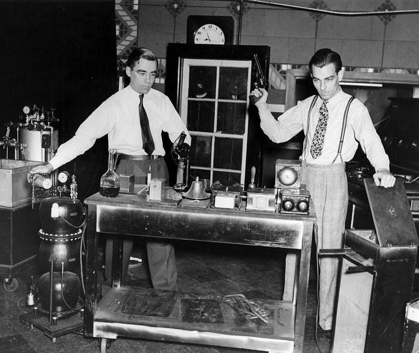

+++
title = "Character"
outputs = ["Reveal"]
[reveal_hugo]
margin = 0.2
+++

<!-- Sources: Sound design for film chatper 2 + Foley Grail Chapter 3 -->



# Foley: history of a craft

---

#### Foley in the US: Jack Foley

{}
- Jack Foley, a New Yorker of Irish descent, grew up on Long Island.
- When Universal needed to add sound to *Showboat* (1929), Jack seized the opportunity to help solve the challenges brought by synchronized sound.
- *The Jazz Singer* (1927) introduced Warner Brothers’ recording small segments of sound for Al Jolson’s singing, while the rest of the film remained silent.
{}

---

<iframe width="560" height="315" src="https://www.youtube.com/embed/zgWWZlv6FqU" title="YouTube video player" frameborder="0" allow="accelerometer; autoplay; clipboard-write; encrypted-media; gyroscope; picture-in-picture" allowfullscreen></iframe>

---

## Sound as Storyteller 

### Once Upon a Time in the West (1968)

[Watch Once Upon a Time in the West](https://www.amazon.com/gp/video/detail/0QX0P475K94L8YQ00JKNJ9ZIM4) - 0:00 - 13:00 

{}
- The entire sound and dialogue were reproduced in post-production. 
- The edited sound effects and Foley tell the story and provide insight into characters.
- Scene Plot Summary:
  - Three men appear at a train station and proceed to wait. Their movements are slow and deliberate, accompanied by distinct Foley sounds, such as footsteps on a wooden floor and flapping dustcoats.
  - One man (Jack Elam) fights with a fly, smashing it with his pistol barrel, and the Foley highlights his calm and patience.
  - Another man (Woody Strode) lets water drip from his hat into his mouth, emphasizing the slowness and heat of the day.
  - The third man (Al Mulock) runs his hands through a water trough, signaling their "bad guy" demeanor. 
  - They wait for a train, and a creaking windmill sound adds to the eerie atmosphere.
  - As the train leaves, Charles Bronson's character is revealed through the sound of his harmonica, signaling his presence.
  - Dialogue and gunfire follow, propelling the story forward.
- Director **Sergio Leone** preferred to replace all sounds in post-production, adding a stylized, artificial quality to the audio, which became an integral part of his storytelling.
- Italian Foley artist **Marco Ciorba** shared that his father Aldo worked on Leone's films, and Foley artists often visited the sets to observe actors and surfaces for realistic sound design.
{}

---

## Foley and animated characters

### How to Train Your Dragon (2010)

<iframe width="560" height="315" src="https://www.youtube.com/embed/Jw0EBmAVjT0" title="YouTube video player" frameborder="0" allow="accelerometer; autoplay; clipboard-write; encrypted-media; gyroscope; picture-in-picture" allowfullscreen></iframe>

{}
- Sound design by Randy Thom — the author of the "Designing for Sound" essay we read in week 2. Thom has argued that animation gives sound designers more creative freedom than live action, because nothing arrives from the set: every sound is a choice.
- The "Forbidden Friendship" scene is nearly dialogue-free. Toothless is characterized entirely through designed vocalizations (built from animal recordings and human performance) and Foley.
- Listen for the Foley carrying the bond: footsteps on rock, the stick scratching the dirt drawing, cloth moves as Hiccup edges closer.
- Like *Once Upon a Time in the West*, this is sound as storyteller — but with zero production audio to lean on.
{}

---

## Foley and first person experience 

- *Hardcore Henry* (2015)
- ["Enter the Void" (2009)](https://youtu.be/PGtumTVHRcQ?si=57zqteTcxDrlekas) 
- "Doom" (2005) - [First Person Shooter Sequence (Full Scene)](https://www.youtube.com/watch?v=KmN1Xk1SdwQ)

{}
- *Hardcore Henry* (2015): 
  - Entire movie shot from a first-person perspective.
  - Extensive Foley sound creates an immersive experience for the audience.
- *Enter the Void* (2009):
  - Directed by Gaspar Noé.
  - Uses first-person perspective to convey the protagonist’s experiences.
  - Foley sound plays a crucial role in immersing the audience in both visual and auditory experiences.
- *Doom* (2005):
  - Based on the popular video game series.
  - Incorporates first-person sequences with Foley sound to enhance the character's perspective, especially in action scenes.
{}

---

## Foley and inner turmoil 

<iframe width="560" height="315" src="https://www.youtube.com/embed/XrY9DJLDxOc?si=K3Xtk4Aobgz37hln" title="YouTube video player" frameborder="0" allow="accelerometer; autoplay; clipboard-write; encrypted-media; gyroscope; picture-in-picture; web-share" referrerpolicy="strict-origin-when-cross-origin" allowfullscreen></iframe>

{}
Sound Design Elements:
- Naturalistic Foley: The sound of cups clinking, people shuffling, chairs moving, and other typical café noises are carefully crafted to feel authentic, emphasizing the normalcy of the environment.
- Emotional Contrast: While the setting is lively and ordinary, Anders is emotionally distant. The café sounds grow more intrusive, symbolizing his disconnection from life.
- Layering of Dialogue: Various conversations in the background are layered together, creating an immersive soundscape. The increasing volume and the overlapping nature of the dialogue reflect Anders' growing sense of being overwhelmed by the world around him.
- Absence of Music: There is no musical score, which draws attention to the natural sounds and the emotional tension of the moment. This silence heightens the realism and isolation.
{}

---
## Foley and suspense 

- [The Thing Dog Transformation Scene | The Thing (1982) ](https://www.youtube.com/watch?v=_C9JbK7slrk)
- [Poltergeist - Haunted Bedroom Scene](https://www.youtube.com/watch?v=8J9sU2n5fIc)

{}
- *The Thing* (1982):
  - A dog is absorbed by the creature in a suspenseful scene.
  - Foley effects such as footsteps, growling, and chewing add tension to the dog’s interactions in the scene.
  - The mixture of “gush, gunk, and gore” Foley and cicada sound effects enhances the unsettling nature of the transformation.
- *Poltergeist* (1982):
  - A scene in a child’s bedroom where toys fly and slam into a closet.
  - Loud music and exaggerated toy sound effects create chaos.
  - Foley for a clown doll adds a playful jingle to contrast the eerie atmosphere, highlighting the character’s irony.
{}

---

## Practical Foley design

- Categories of Foley:
  - Moves (cloth sound)
  - Footsteps
  - Specifics (props)

{}
- Foley is recorded in layers within a DAW like Reaper.
- Despite advances in technology, human-performed Foley remains irreplaceable for realism.
- Experienced Foley artists discern what should be heard and what should be ignored, focusing the sound on key elements of the scene rather than cluttering it.
- As technology allows for more options in shorter spans of time, Foley artists must prioritize essential sounds.
{}

---

## Moves

<iframe width="560" height="315" src="https://www.youtube.com/embed/-SUcALp4avE" title="YouTube video player" frameborder="0" allow="accelerometer; autoplay; clipboard-write; encrypted-media; gyroscope; picture-in-picture" allowfullscreen></iframe>

{}
- Cloth sound helps bring characters to life and build intimacy.
- Smooths over edits in dialogue tracks.
- Cloth Foley should be subtle; its absence would be noticed by the audience.
- Requires careful editing to sync with movement and remove unwanted sounds.
- Moves are often the first pass of a Foley artist, allowing the entire character's movements to be captured.
- Cotton and denim are favored due to their natural sound, while synthetic fabrics may sound scratchy or clicky.
{}

---

## Steps

<iframe width="560" height="315" src="https://www.youtube.com/embed/eobm9HzVnvI" title="YouTube video player" frameborder="0" allow="accelerometer; autoplay; clipboard-write; encrypted-media; gyroscope; picture-in-picture" allowfullscreen></iframe>

{}
- Steps define a character further: shoe choice and walking style reveal personality and mood.
- Foley artists use a heel-toe technique to create distinct sounds for each step, sometimes adding a slide or shuffle.
- Artists must wear soft clothes (usually cotton) to minimize unwanted noise during performance.
{}

---

## Specifics - Spots

<iframe width="560" height="315" src="https://www.youtube.com/embed/WnozP8OWeik" title="YouTube video player" frameborder="0" allow="accelerometer; autoplay; clipboard-write; encrypted-media; gyroscope; picture-in-picture" allowfullscreen></iframe>

{}
- Specifics (or spots) are any actor interactions outside of moves or steps.
- These could include prop handling or environmental interactions.
{}