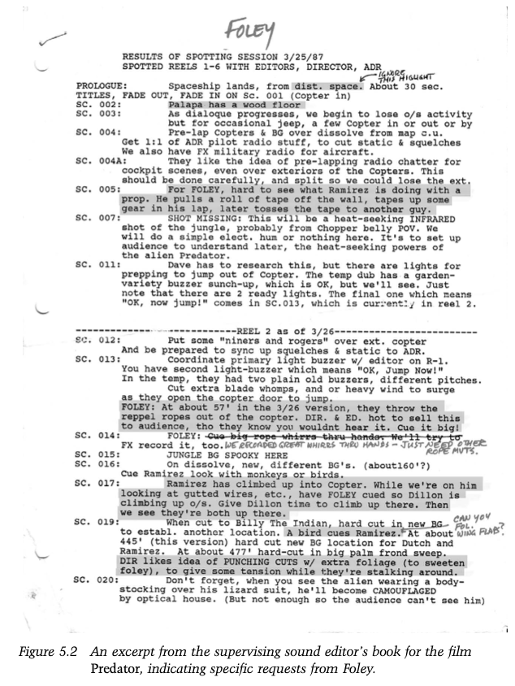
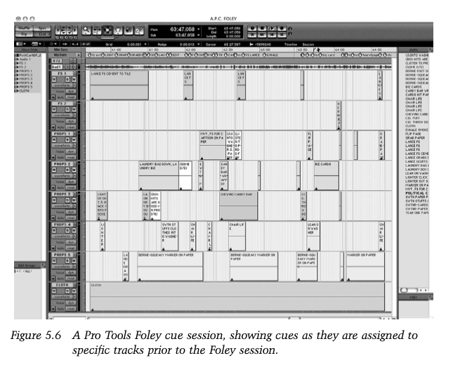

+++
title = "Spotting, Cueing, and Editing Foley"
outputs = ["Reveal"]
[reveal_hugo]
# show_notes = "separate-page"
+++

## Spotting, Cueing, and Editing Foley

This lesson follows Vanessa Theme Ament, *The Foley Grail*, 3rd ed., ch. 4 and 5.

{}
The process starts before anyone steps on a stage. In a spotting session, the supervising Foley editor sits with the supervising sound editor, the director, and the picture editor to break down each scene, set the film's sonic style, and divide the work between library effects and performed Foley. The editor then maps every cue into a session, and that map is what makes the stage day efficient.

Ament's benchmark is worth quoting to students: an experienced editor takes about four hours to cue ten minutes of film. Cueing is real editorial work, not clerical prep.
{}

---

{}
What the spotting session decides:

- Who attends: the supervising sound editor, the director, and the picture editor, sometimes joined by the ADR supervisor or the Foley supervisor.
- What gets settled: which sounds will be performed as Foley, which come from libraries, and what style the film's sound should have.
- Why it survives budget pressure: a planned session saves real money at the final mix, because problems get solved on paper instead of on the stage clock.
{}

---

{}
Ament's track layout, which is still the standard shape of a Foley session:

- Principal footsteps go first, one character per track for the whole reel: Mimi on track 1, Joe on track 2, and so on.
- Background footsteps follow, tagged so the artist can find the person instantly on screen: "tall man, blue shirt, right to left" or "two girls running center."
- Props group by what Ament calls food groups: paper together, metal together, hand pats together, leather together. The mixer can then set the microphone once per texture instead of once per cue.
- A single cloth pass sits on its own track at the end. The re-recording mixer tucks cloth under the dialogue, and cloth spread across several tracks turns into an unusable whoosh.

Cue sheets used to be handwritten in vertical columns; the same layout now lives horizontally in a DAW timeline, and cue sheets can still be printed from the session.
{}

---

## Cue with a breath

- Do not cue on the first frame of movement. Leave a breath before the action so the artist can anticipate it, because Foley is a performance.
- When the picture cross-cuts between two characters, keep each character's cue running through the cuts. Chopping the cue at every cut kills the rhythm of the walk.

{}
- Both rules come from Ament, ch. 5, and both exist for the same reason: the artist performs a scene, not a list of timestamps.
- This is also why Foley cueing is looser than ADR cueing, which must hit lip-sync exactly.
{}

---

## Two stories worth knowing

- Jerry Trent was hired to Foley Mikhail Baryshnikov's dancing in *The Turning Point* (1977). The film's choreographer doubted a Foley artist could match the steps. Trent's answer: "I don't have to do the same steps, they just have to sound like the steps. I can do most of this sitting down."
- For *The Godfather Part II*, Walter Murch and mixer Mark Berger skipped the Foley stage entirely. They calibrated a metronome to the film's frames per footstep, set it to flash instead of click, and walked real marble stairs in San Francisco in sync with the silent light.

{}
- The Trent story teaches the foundational Foley truth: the job is the sonic illusion, not literal reenactment.
- The Murch story teaches the opposite lesson: sometimes the illusion requires the real place, real marble, and real architectural reflections. Both stories are in Ament, ch. 1 and 8.
{}

---

## Cuing process

1. Watch each scene several times before writing anything.
2. Cue the main characters first, one per track, adding tracks when a walk crosses different surfaces.
3. Cue background characters with direction tags rather than names.
4. Cue props last, grouped by food group so the mixer works in sweeps.

{}
- Precision with conciseness: if multiple men carry children in a scene, "man carrying child" fails and the cue must say which man.
- The end goal is a road map that lets the artist, the mixer, and the editor work the stage day without stopping to ask questions.
- Source: Ament, ch. 5.
{}
